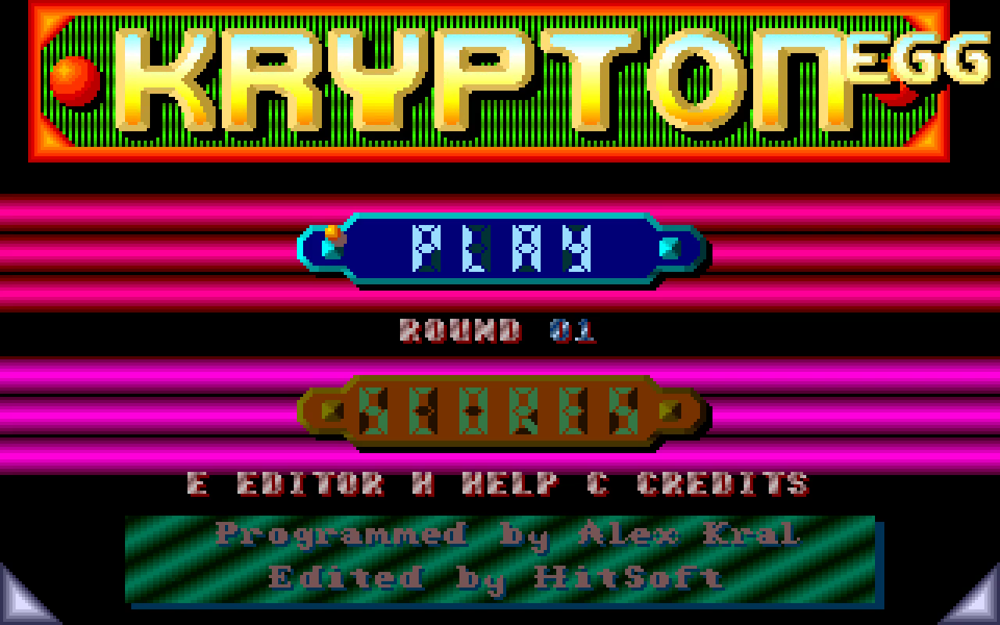
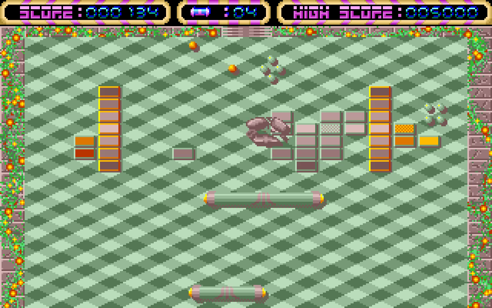
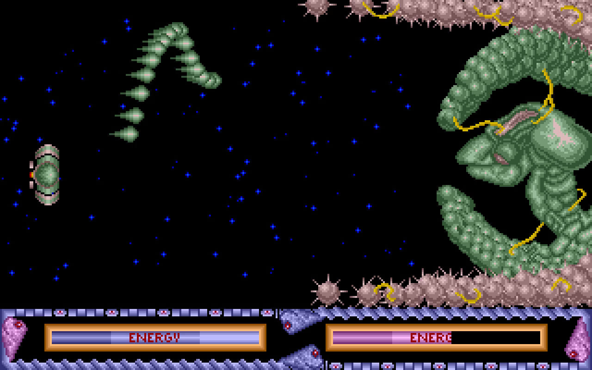
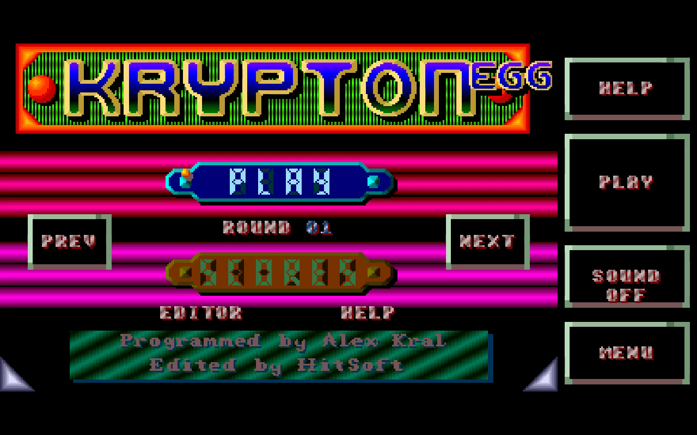

# Krypton Egg — Go / Ebitengine

A native Go port of the Amiga game Krypton Egg. All game logic,
physics, input, rendering, construction tools, and persistence are rewritten in
Go. The game does not run the Amiga executable or require an emulator.

The artwork, bitmap fonts, 60 level layouts, enemy selections, two tracker
modules, and 21 recovered sound variants come exclusively from that disk. Music is replayed
by **go-zikmu** through Ebitengine's audio backend. Everything needed to play is
embedded in the executable.

The extraction, reverse-analysis, and recording scripts remain
versioned. Reconstruct the local game data before compiling:

```sh
# Place your ADF in the ignored previous/ directory, or select its local path.
export KRYTONEGG_ADF="/path/to/Krypton Egg.adf"
python3 -m pip install -r tools/requirements.txt
make assets
```

No replacement artwork or another game release is downloaded. `make run`,
`make build`, and the Android script check that the local reconstruction is current.

## Run

Requires Go 1.26 or newer and a desktop graphics environment.

```sh
make run
```

The initial window is **1280 × 800**. Resize it or press **F** for fullscreen.
Rendering uses integer nearest-neighbor zoom and centered letterboxing to retain
the original 320 × 200 proportions. The simulation keeps native coordinates;
moving objects are rendered directly at the higher output resolution.

```sh
make build
./bin/krytonegg
```

The dependencies are pinned in `go.mod`. No C compiler, Python, Kickstart ROM, or
Amiga installation is required for desktop play. Python and Pillow are used only if you
choose to reproduce the asset conversion.

## Controls

| Control | Action |
| --- | --- |
| Mouse / arrows / WASD | Move the paddle; vertical movement requires its original bonus |
| Left click / F2 / Enter | Release an attached ball |
| Hold left click / F2 | Fire when a weapon is active; fire in an alien combat |
| Space | Pause or resume during a round or combat |
| F1 | Switch PAL (50 updates/s) and NTSC (60 updates/s) |
| F3 | End the current game and return to the title |
| P / Escape | Additional pause controls |
| F / F11 | Toggle fullscreen |
| M | Toggle sound |
| H | Open or close help |
| C | Show the original credits from the title |
| Q | Quit from the title or pause screen |

The title retains **PLAY** and **SCORES**. Click the corresponding button, or use
Up/Down and Enter. Left/Right selects a starting round. Press **E** on the title
to open the construction set. Touch input and standard gamepad movement/fire
are also supported.

The intro retains the original folded image reveal and scrolling instructions.
Click to advance. A new round displays the original zero-based **LEVEL** banner;
click once to enter the field and again to release the attached ball. The named
Hall of Fame accepts up to sixteen characters and preserves the original ten
default entries. Alien victories and defeats display the recovered messages.

The recovered optional codes work only after manual startup authorization:
hold **Insert** (Amiga Help) and the left mouse button during the intro. Then
F10 preserves normal-round reserves, Escape skips to the next original stage,
Ctrl selects the final combat, and F8 reduces an active boss to eight energy.
These codes are off by default and always disabled for simulated players,
validation runs, and recordings.

## Campaign and construction set

The original 60 grids include layered bricks, permanent obstacles, disappearing
bricks, regenerating obstacles, and paired teleporters. The original encoded
bonuses control paddle size, magnet, mouse sensitivity, reversed movement,
score multiplier, darkness, spare lives, additional balls, ball size/speed,
autopilot, vertical movement, ghost paddle, shield, cannons, super/ghost balls,
second paddle, random effects, and four laser modes. The native enemy choice
table supplies the six monster families and lethal-contact flags.

An alien combat follows each group of ten rounds. The six fights use the
original ship, animated mouth, projectiles, collision profile, and energy meters.
Losing an alien combat ends the run, as on this disk.

The construction set edits an 18 × 16 grid with original tiles:

- Left click paints; right click erases.
- Left/Right or the mouse wheel selects a tile.
- **B** selects an encoded bonus; **V** selects its two-bit strength.
- **S** saves; **L** reloads; **Enter** tests the edited level.
- **Escape** returns from the test to the editor, then from the editor to the title.

Custom levels use the original 576-byte big-endian format. High scores and
`custom.level` are stored in the OS user configuration directory under
`krytonegg/`. Use `-data-dir` to select another location.

```sh
go run . -level 12
go run . -combat 1
go run . -scale 5 -fullscreen
go run . -editor -data-dir ./captures/local-data
go run . -custom ./captures/local-data/custom.level
```

## Android

The Android version shares the same Go simulation, original assets, and music.
Its landscape view adds an 80-unit touch sidebar beside the original 320 × 200
frame. Drag one finger within the field to move without jumping to the contact
position. Use a second finger on **FIRE** to launch or hold fire. **PAUSE**,
**SOUND**, and **MENU** remain accessible beside the field. The title, scores,
help, and construction set have touch controls as well.

```sh
make android
# Build, install, and launch on the connected Android device.
make android-run
# Preview the same controls on desktop.
make touch
```

The APK is generated at `android/app/build/outputs/apk/debug/app-debug.apk`.
Android requires SDK 36, NDK 28.2, and Java 17 or 21 for building; the scripts
reuse the same toolchain conventions as the neighboring Android projects.
No network or storage permissions are required by the installed application.
Scores and custom levels live in its private storage directory. Returning
from the background leaves an active round paused until **RESUME** is pressed.

See [Android setup and controls](docs/android.md) for overrides, installation,
verification, and the small platform lifecycle bridge.

## Verification and asset provenance

```sh
make test
make vet
CGO_ENABLED=0 go build -o bin/krytonegg .
./bin/krytonegg -mute -smoke 260 -capture captures/round.png -data-dir .cache/check-data
./bin/krytonegg -mute -combat 1 -smoke 45 -capture captures/combat.png -data-dir .cache/check-data
go run ./cmd/validate-progression -mode campaign -seed 42 -speed 12 -reaction 4 \
    -out captures/progression/campaign.json
```

The automatic check uses deterministic input and exits after the requested
number of updates. Captures contain the actual Ebitengine render. Simulation
tests cover native level decoding, collisions, paddle momentum, bonuses, enemy
hazards, weapons, teleporters, regeneration, scoring, and all six combat
transitions. Audio tests render both original modules using go-zikmu.

To reproduce the lossless conversion:

```sh
python3 -m pip install -r tools/requirements.txt
make assets
```

See [asset extraction](docs/asset-extraction.md),
[original references](docs/original-reference.md), and
[port status](docs/port-status.md) for source offsets, recovered rules, and the
remaining limits of behavioral fidelity. Assets are original; the rewritten
simulation uses modern collision resolution rather than reproducing every
68000 instruction or Amiga hardware timing effect. Native velocity, cannon,
enemy, death, reserve, and boss rules were checked against the original routines.
Bonus ID 5 has no identified consumer
in this disk's behavior table and is retained as inert data.

See [original comparison and recovered rules](docs/fidelity-audit.md) and
[expert-player progression](docs/progression.md). FS-UAE comparison sessions use
silent Paula hardware emulation and isolated input recordings. Ghidra scripts
and frame comparison tools are under `tools/reverse/`.

The final-source continuous campaign cleared all **60 rounds and six combats**
without cheats. Its verified profile uses 80 ms delayed observations, a maximum
of 600 native pixels/second and bounded acceleration; it starts with five lives
and finishes with twenty-one, earned through normal play. The presentation uses
that same verified player profile.

## Simulated expert and presentation video

```sh
go run . -expert -mute
go run . -showcase -movie captures/presentation/krypton-egg.mp4 -mute \
    -seed 42 -player-reaction 4 -player-speed 12 \
    -data-dir .cache/presentation-data
python3 tools/encode_presentation.py captures/presentation/krypton-egg.mp4 \
    --output captures/presentation/krypton-egg-english.mp4
```

The simulated player submits ordinary inputs with delayed observations, bounded
mouse speed and acceleration. It does not move balls, remove bricks, grant
power-ups, award lives, or skip campaign rounds. Standalone practice encounters
are identified separately in reports and in the movie subtitles.

The four-minute presentation includes options, 190 seconds of continuous
campaign play, and twenty seconds of a clearly labelled boss practice encounter.
The recording reads only Ebitengine's own rendered frames. Original music and
sound samples are mixed offline, with live playback muted. English subtitles
are included as an MP4 track and can be burned into a footer beneath the game.
No desktop, microphone, or system-audio capture is used. Movie exports remain
local under the ignored `captures/` directory.

## Screenshots

These are rendered remake review images, rather than extracted source assets.






## Project layout

- `internal/game`: deterministic simulation without renderer/audio dependencies.
- `internal/presentation`: Ebitengine renderer, input, title, construction set, and saves.
- `internal/sound`: original PCM effects and go-zikmu tracker playback.
- `internal/player`: delayed, bounded expert-player inputs.
- `internal/recording`: native frame encoding and offline original audio.
- `assets`: Go embedding code and locally regenerated, ignored game data.
- `tools/extract_adf.py`: reproducible OFS/planar/Paula conversion.
- `previous`: untouched reference disk.

Original game: HitSoft; programming Alexandre Kral; graphics Alexandre and
Xavier Kral; music Jean-Pierre Vidos; sound effects Philippe Deneyer. Original
assets retain their original ownership.
